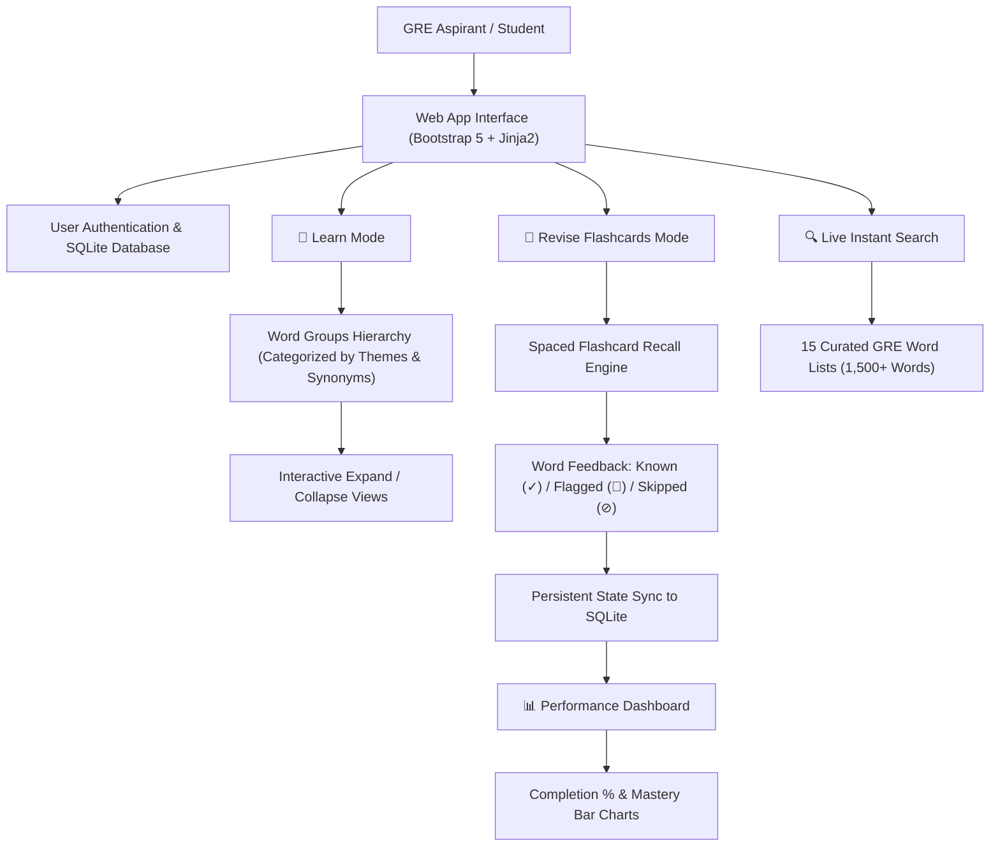

# 📚 V-Buddy: Interactive GRE Vocabulary Learning Platform

A comprehensive, full-featured web application designed to accelerate GRE / SAT / TOEFL vocabulary mastery through structured word groupings, active recall flashcards, live cross-list search, and persistent user progress tracking.

---

## 🌟 Architecture & Study Modes



---

## 🚀 Key Features

- **📖 Learn Mode**: Browse high-frequency GRE words structured into conceptual semantic clusters. Word groups are automatically sorted by cluster size and alphabetical order with expandable cards.
- **🧠 Active Recall & Flashcard Quizzing**: Interactive front-and-back flashcard testing with randomized shuffling. Instantly tag words as **Known (✓)**, **Flagged (🚩)**, or **Skipped (⊘)** to target weak vocabulary.
- **🔍 Instant Universal Search**: Live real-time search across all 15 master word lists with instant highlighting of definitions, parts of speech, synonyms, and mnemonics.
- **📊 Real-Time Analytics Dashboard**: Detailed visual progress meters per word list displaying total mastered words, flagged terms for review, and overall completion percentages.
- **🔒 Multi-User Persistence**: Lightweight SQLite database backend preserving individual learning profiles, custom flagged words, and study streaks.
- **🐳 Docker & Cloud Ready**: Fully containerized and configured for one-click deployment on Hugging Face Spaces, Docker, or any cloud VM.

---

## 📁 Repository Structure

```
├── app.py                     # Main Flask web application & SQLite ORM routes
├── requirements.txt           # Python dependencies
├── Dockerfile                 # Docker container specification (Port 7860)
├── UpdatedLists/              # 15 structured GRE vocabulary module datasets
│   ├── list1.py ... list15.py # Individual word groupings and definitions
├── static/                    # Frontend styling, scripts, and media
│   ├── css/style.css
│   └── js/app.js
└── templates/                 # Jinja2 responsive HTML templates
    ├── index.html             # Core dashboard, Learn, and Revise views
    └── login.html             # User authentication screen
```

---

## 🛠️ Local Development & Quickstart

### 1. Python Environment Setup
```bash
git clone https://github.com/Saiyam008/V-Buddy.git
cd V-Buddy

# Create virtual environment
python -m venv venv
source venv/bin/activate  # On Windows: venv\Scripts\activate

# Install dependencies
pip install -r requirements.txt

# Run the app
python app.py
```
Open [http://localhost:7860](http://localhost:7860) in your browser.

### 2. Run with Docker
```bash
docker build -t v-buddy .
docker run -p 7860:7860 v-buddy
```

---

## 📄 License

This project is licensed under the [MIT License](LICENSE).
